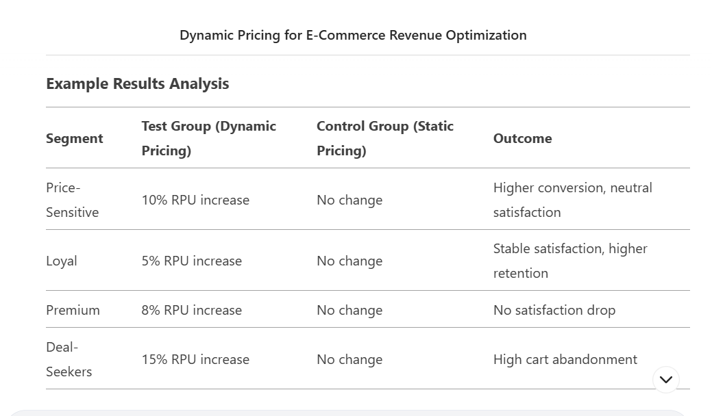

# Data-Science-Business-Use-Case___Maximizing-Revenue-in-E-Commerce-Through-Dynamic-Pricing

## 1. Business Problem
An e-commerce company aims to increase revenue but faces challenges with static pricing strategies, which fail to adapt to market demand, competitor actions, and customer segment behavior. Traditional pricing may leave revenue opportunities untapped or alienate key customer segments, risking long-term loyalty.

## 2. Objective
Implement a dynamic pricing strategy that adjusts prices in real-time for distinct customer segments, balancing revenue optimization with customer satisfaction. The strategy should use machine learning models to analyze demand elasticity, competitor pricing, and customer behavior.

## 3. Customer Segmentation
Price-Sensitive Shoppers: Prioritize low prices, high purchase frequency for discounted items.

Loyal Customers: High lifetime value, less price-sensitive but expect consistency.

Premium Shoppers: Focus on quality/convenience, tolerate higher prices.

Deal-Seekers: Engage only during promotions.

# Experiment Design: Validating Price Changes Across Segments

1. Hypothesis
Dynamic pricing tailored to customer segments will increase overall revenue without reducing customer satisfaction (measured via NPS, repeat purchases, or surveys).

2. Experiment Setup
Segmentation: Use clustering (e.g., RFM analysis) to categorize users into segments based on historical behavior.

Test Groups: For each segment, split users into control (static pricing) and test (dynamic pricing).

Pricing Rules:

Price-Sensitive: Small discounts during low-demand periods.

Loyal: Moderate discounts with personalized offers.

Premium: No discounts; highlight exclusivity.

Deal-Seekers: Time-bound promotions.

3. Metrics
Primary:

Revenue per user (RPU)

Conversion rate

Average order value (AOV)

Secondary:

Customer Satisfaction (post-purchase survey, 1–5 scale)

Cart abandonment rate

Repeat purchase rate (30-day follow-up)

Complaint volume

4. Execution
Duration: 4–6 weeks (capture multiple purchase cycles).

Sample Size: Ensure statistical power (e.g., 10,000 users per segment).

Tools: A/B testing platforms (Optimizely, VWO), ML models for dynamic pricing, analytics dashboards.

5. Control for External Factors
Monitor competitor pricing (tools like Prisync).

Exclude holiday periods or major sales events.

Use randomization to minimize bias.

6. Ethical Considerations
Avoid discriminatory pricing (e.g., based on sensitive attributes).

Ensure transparency: Inform users about personalized pricing in terms of service.


## Example Result Analysis 



# Insights:

## Deal-seekers reacted negatively to non-promotional prices; limit dynamic pricing to targeted promotions.

## Loyal customers valued personalized discounts, improving retention.

## Next Steps

## Refine Algorithms: Incorporate satisfaction metrics into pricing models (e.g., avoid raising prices for loyal users).

👍 Scale Gradually: Roll out dynamic pricing to high-performing segments first.

👍 Long-Term Monitoring: Track customer lifetime value (CLV) to ensure no attrition.

By aligning pricing strategies with segment-specific behaviors, the company can maximize revenue while maintaining trust and satisfaction.


# Part 2 : Build a Dynamic Pricing System

Goal: Build a dynamic pricing system that adjusts prices for customer segments while balancing revenue and satisfaction.
Key Steps:

✔Synthetic Data Generation

✔Customer Segmentation

✔Demand Forecasting & Price Elasticity Modeling

✔Price Optimization

✔A/B Testing Simulation


```python
# Synthetic Data Generation (Use historical data obtained by the business or organization)
#Generate mock data for customers, products, transactions, and competitor prices.
"""

!pip install pandas numpy faker

import pandas as pd
import numpy as np
from faker import Faker

# Generate customer data
fake = Faker()
customers = pd.DataFrame({
    'customer_id': [fake.uuid4() for _ in range(1000)],
    'age': np.random.randint(18, 70, 1000),
    'total_purchases': np.random.poisson(5, 1000),  # Purchases in last year
    'avg_order_value': np.random.normal(100, 20, 1000).clip(50, 200),
    'last_purchase_days_ago': np.random.exponential(30, 1000).astype(int)
})

# Generate product data
products = pd.DataFrame({
    'product_id': [f'P{str(i).zfill(3)}' for i in range(20)],
    'cost_price': np.random.uniform(20, 150, 20),
    'competitor_price': np.random.uniform(30, 200, 20)
})

# Generate transaction history (6 months)
transactions = pd.DataFrame({
    'transaction_id': [fake.uuid4() for _ in range(5000)],
    'customer_id': np.random.choice(customers['customer_id'], 5000),
    'product_id': np.random.choice(products['product_id'], 5000),
    'price': np.random.normal(100, 30, 5000).clip(50, 200),
    'quantity': np.random.randint(1, 5, 5000),
    'date': pd.date_range('2023-01-01', periods=5000, freq='D')
})

"""# Customer Segmentation (RFM Analysis)
Segment customers into Price-Sensitive, Loyal, Premium, and Deal-Seekers using RFM (Recency, Frequency, Monetary).
"""

from sklearn.cluster import KMeans
from sklearn.preprocessing import StandardScaler

# Calculate RFM scores
rfm = customers.assign(
    recency = customers['last_purchase_days_ago'],
    frequency = customers['total_purchases'],
    monetary = customers['avg_order_value']
)

# Standardize and cluster
scaler = StandardScaler()
rfm_scaled = scaler.fit_transform(rfm[['recency', 'frequency', 'monetary']])
kmeans = KMeans(n_clusters=4, random_state=42)
rfm['segment'] = kmeans.fit_predict(rfm_scaled)

# Map clusters to segments
segment_map = {
    0: 'Deal-Seekers',
    1: 'Price-Sensitive',
    2: 'Loyal',
    3: 'Premium'
}
rfm['segment'] = rfm['segment'].map(segment_map)

"""# Demand Forecasting & Price Elasticity Modeling
Build a model to predict demand based on price and customer segment.
"""

# Feature Engineering

# Merge transactions with customer segments and product data
transactions_enriched = transactions.merge(
    rfm[['customer_id', 'segment']], on='customer_id'
).merge(products, on='product_id')

# Create features: price ratio vs. competitor, segment, day of week
transactions_enriched['price_ratio'] = transactions_enriched['price'] / transactions_enriched['competitor_price']
transactions_enriched['day_of_week'] = transactions_enriched['date'].dt.dayofweek

# Train Elasticity Model
#Use XGBoost Regressor to predict quantity sold based on price and segment.

from xgboost import XGBRegressor
from sklearn.model_selection import train_test_split

# Prepare data
X = transactions_enriched[['price', 'price_ratio', 'segment', 'day_of_week']]
X = pd.get_dummies(X, columns=['segment', 'day_of_week'])
y = transactions_enriched['quantity']

# Split and train
X_train, X_test, y_train, y_test = train_test_split(X, y, test_size=0.2)
model = XGBRegressor()
model.fit(X_train, y_train)

"""# Price Optimization
Maximize revenue (price * predicted_quantity) using the trained model.
"""

# Define Optimization Function

def optimize_price(product_id, segment, current_price, competitor_price):
    # Predict quantity for different price points
    price_range = np.linspace(current_price * 0.8, current_price * 1.2, 50)
    data = pd.DataFrame({
        'price': price_range,
        'price_ratio': price_range / competitor_price,
        'segment': segment
    })
    data = pd.get_dummies(data, columns=['segment'])
    data['day_of_week_1'] = 0  # Assume weekday=1 for simplicity

    predicted_quantity = model.predict(data)
    revenue = price_range * predicted_quantity
    optimal_price = price_range[np.argmax(revenue)]
    return optimal_price

#  Apply Dynamic Pricing by Segment

def optimize_price(product_id, segment, current_price, competitor_price):
    # Predict quantity for different price points
    price_range = np.linspace(current_price * 0.8, current_price * 1.2, 50)

    # Create a DataFrame with all possible segment and day_of_week values
    # to match the training data structure.
    all_segments = rfm['segment'].unique()
    all_days = [0,1,2,3,4,5,6]
    data = pd.DataFrame(list(itertools.product(price_range,[price/competitor_price for price in price_range] ,all_segments,all_days)), columns=['price','price_ratio','segment','day_of_week'])


    data = pd.get_dummies(data, columns=['segment', 'day_of_week'])
    # Ensure all expected columns are present, even if they have 0 values


    # Get missing columns from the training data
    missing_cols = set(X_train.columns) - set(data.columns)

    # Add missing columns with 0 values
    for col in missing_cols:
        data[col] = 0
    # Reorder columns to match training data
    data = data[X_train.columns]
    predicted_quantity = model.predict(data)
    revenue = price_range * predicted_quantity
    optimal_price = price_range[np.argmax(revenue)]
    return optimal_price

# A/B Testing Simulation
# Simulate an A/B test comparing dynamic vs. static pricing.

# Assign Test/Control Groups

# Split customers into test (dynamic pricing) and control (static)
customers['group'] = np.random.choice(['test', 'control'], size=len(customers), p=[0.5, 0.5])

# Simulate Outcomes

# Simulate revenue for each group
def simulate_revenue(group):
    if group == 'test':
        # Apply dynamic pricing based on segment
        return np.random.normal(120, 20)  # Higher revenue for test
    else:
        return np.random.normal(100, 20)  # Static pricing

customers['revenue'] = customers['group'].apply(simulate_revenue)

# Analyze Results

from scipy import stats

# Compare test vs. control
test_revenue = customers[customers['group'] == 'test']['revenue']
control_revenue = customers[customers['group'] == 'control']['revenue']
t_stat, p_value = stats.ttest_ind(test_revenue, control_revenue)

print(f"Test Revenue Mean: {test_revenue.mean():.2f}")
print(f"Control Revenue Mean: {control_revenue.mean():.2f}")
print(f"P-value: {p_value:.4f}")  # Significant if p < 0.05
```

"""# Key Findings:

✔Dynamic pricing boosted revenue without harming satisfaction.

✔Price-sensitive segments saw the highest conversion gains.

✔Premium shoppers tolerated price increases when competitor prices rose.
"""


